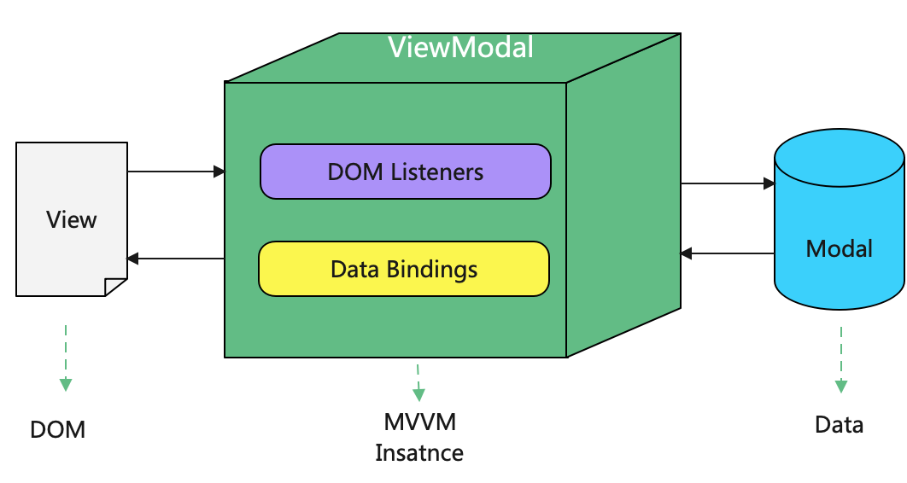
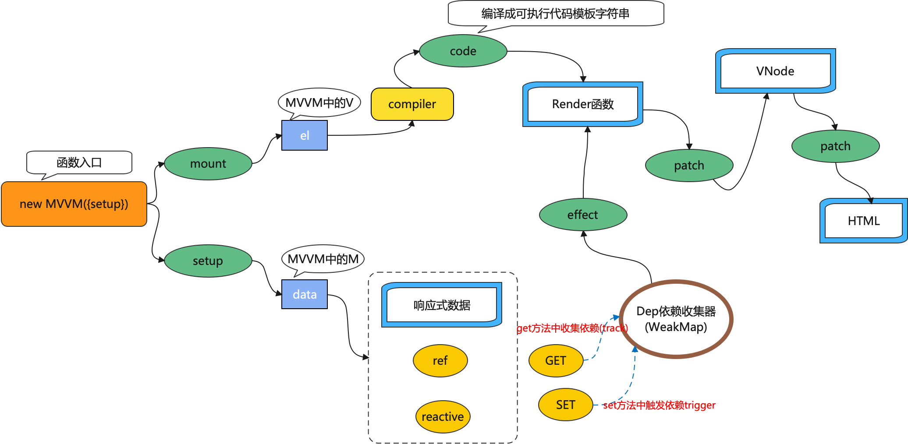
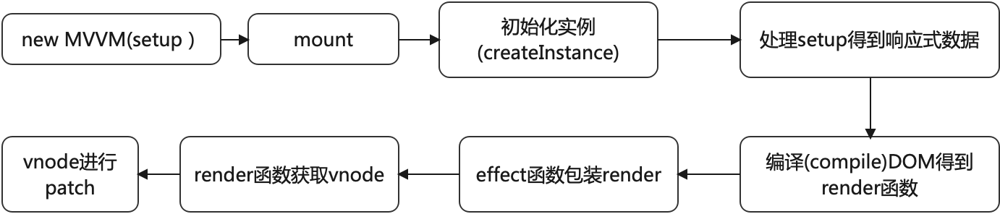

# MVVM

## MVVM工程启动说明

```bash
yarn build
```

然后打开example目录下的内容

## MVVM原理

MVVM即 Model View ViewModel，MVVM 就是将其中的View 的状态和行为抽象化，让我们将视图 UI 和业务逻辑分开，所有的交互都通过ViewModel进行，从而达到低耦合的优点。View的修改独立于Model的修改，可提高重用性，可在View中重用独立的视图逻辑。归根结底可总结为数据的双向绑定的过程，即ViewModel的数据与Model的绑定，ViewModel的数据与View中的数据绑定，从而达到数据低耦合高重用性的过程。
MVVM的基础模式其实不复杂，通过该原理主要就是需要实现ViewModel层到Model层与View层的交互过程。MVVM模型可如下：



要实现基本的`MVVM`,应具备以下几点要素

1. 响应式数据
   
   MVVM 的核心在于 View 和 Model 分离之后的数据绑定，即每次修改 Model 中的数据，View 都能随时得到更新，而不是手动去修改 DOM 。这就需要有一套完善的响应机制，其实就是一种观察者模式。在初始化页面的时候，监听 Model 中的数据，一旦有变化，立即触发通知，更新 View 。

2. 模板引擎
   
   模板语法上就是一段 html 代码片段，纯 html 代码的特点是静态，可以定义一些指令，该模板就不再是静态的，而是动态、有逻辑的模板。通过模板引擎会把一个 html 片段最终解析成一个 JS 函数，让它真正动起来。

3. 虚拟DOM
   
   Model 中的数据一旦有变化，就会重新渲染 View ，但是变化也是有范围的。如果 Model 和 View 都比较复杂，而 Model 中的只有一点点数据的变化，就导致了 View 的全部渲染，可显然不合适，性能上也不允许。如果是直接去操作 DOM 修改 View 就很难做到性能的极致，而 vdom 就能做到。ViewModel 不会直接操作 DOM 而是把所有对 DOM 的操作都交给 vdom ，vdom 进行 diff 之后，再决定要真正修改哪些 DOM 节点。

## 源码说明

### 执行流程

`MVVM`代码具体的执行流程如下：



以上为代码的完整流程。主要实现的几个部分为：

- 响应式数据(实现该部分的代码为reactivity)

- 虚拟DOM以及diff算法(实现该部分的代码为vnode和patch)

- 模板编译引擎(实现该部分的代码为compiler)

- 实例: 框架的入口部分，实现mount过程(实现该部分的代码为MVVM)

### 响应式数据(reactivity)

`reactivity` 部分代码用于创建响应式数据,其中  `reactive`函数和`ref`函数分别用于创建响应式对象和响应式原始类型数据。

```ts
export const reactive = function (target: object) {
    if (!isObject(target)) {
        return target;
    }
    if (primitiveToReactive.has(target)) return primitiveToReactive.get(target);

    let observed = new Proxy(target, handler);

    primitiveToReactive.set(target, observed);
    return observed;
}


export const ref = function (value: any) {
    if (isObject(value)) {
        if (isRef(value)) return value;
        else return;
    }

    let result = Object.create(Object.prototype, {
        isRef: { value: true },
        value: {
            get() {
                track(result, 'value');
                return value;
            },
            set(newValue) {
                value = newValue;
                trigger(result, 'value');
            }
        }
    });
    return result;
}
```

其中主要通过[Proxy](https://es6.ruanyifeng.com/#docs/proxy)来实现数据的代理，监听数据的变化过程。

具体的响应式数据和依赖绑定的过程通过effect函数来完成

```ts
export const effect = function <T = any>(fn: (...args: any[]) => T): ReactiveEffect<T> {
    const effect = function (...args: any[]) {
        try {
            activeEffect = effect;
            return fn(...args);
        } finally {
            activeEffect = undefined;
        }
    } as ReactiveEffect

    effect._isEffect = true;
    effect.deps = new Array<Dep>();

    effect();

    return effect;
}
```

这里面的`effect`函数为包装函数，对我们的依赖函数进行包装，包装完成之后，在函数内部进行对依赖函数的调用，如果发生响应式数据的变化，响应式数据则通过在`set`和`get`函数中的`tarck`函数和   `trigger`函数，分别用于收集依赖和触发响应的动作。

```ts
type Dep = Set<ReactiveEffect>
type KeyMap = Map<any, Dep>
const targetMap = new WeakMap<any, KeyMap>();

const track = function (target: object, key: string | symbol) {
    if (activeEffect === undefined) return;

    let keyMap = targetMap.get(target);
    if (!keyMap) targetMap.set(target, (keyMap = new Map()));

    let depsOfKey = keyMap.get(key);
    if (!depsOfKey) keyMap.set(key, (depsOfKey = new Set()));

    if (!depsOfKey.has(activeEffect)) depsOfKey.add(activeEffect);
}

const trigger = function (target: object, key: string | symbol) {
    let keyMap = targetMap.get(target);
    if (!keyMap) return;
    let deps = keyMap.get(key);
    if (!deps) return;
    deps.forEach((effect: ReactiveEffect) => {
        effect();
    });
}
```

### 模板编译引擎(compiler)

模板编译引擎compiler函数主要是将DOM元素，编译成好处理的模板字符串，然后解析模板指令，将模板中的变量替换成数据，然后初始化渲染页面视图，并将每个指令对应的节点绑定更新函数，添加监听数据的订阅者，一旦数据有变动，收到通知，更新视图。

```ts
export function compile(element: Element) {
    let code = `with(this){return ${process(element)}}`;
    return new Function(code);
}
```

这里面我们通过`Function`函数将模板字符串生成`render`函数,在模板字符串的处理过程中,通过`creatElement`函数和`getValue`函数实现模板中虚拟Dom和变量的创建和替换工作。

```ts
export const createElement = (tagName: string, option: AttrProps, children: Array<VNode | string>) => {
    let vnodeChildren: Array<VNode> = [];
    if (children.length > 0) {
        vnodeChildren = children.map(child => {
            if (typeof child === 'string') {
                return createText(child);
            }
            return child;
        })
    }
    let attrs = option.attrs;
    let event = option.event;
    return new VNode({
        tagName,
        type: Node.ELEMENT_NODE,
        attrs,
        event,
        children: vnodeChildren
    });
}
export function getValue(target: any) {
    if (isRef(target)) {
        return target.value;
    }
    return target;
}
```

模板元素的处理过程可分为标签名、属性、子元素的处理，处理过程代码为：

```ts
function process(element: Element | Text) {
    let code = '';
    if (element instanceof Element) {
        code = `this._createElement("${element.localName}",`;
    } else if (element instanceof Text) {
        let text = element.wholeText.replace(SPACE_LINE_BREAK, '');
        let newText = text.replace(PARAM, (match: string) => `\${this._getValue(${match.slice(2, -2)})}`);
        return `\`${newText}\``;
    } else {
        console.error(`element: ${element} is not dom element`);
        return;
    }
    code += processAttrs(element);
    let children = arrayLikeToArray(element.childNodes).map(process);
    code += `,[${children.join(',')}]`;

    return code += ')';

}
function processAttrs(element: Element) {
    let { attributes } = element;
    let code: string[] = [];
    let options: AttrProps = {
        attrs: [],
        event: []
    };
    let attrs: any[] = Array.prototype.slice.call(attributes);
    attrs.forEach(({ name, value }) => {
        if (name[0] === ':') options.attrs!.push(`${name.slice(1)}:${value}`);
        else if (name[0] === '@') options.event!.push(`${name.slice(1)}:${value}`);
        else options.attrs!.push(`${name}:"${value}"`);
    });

    Object.keys(options).forEach(key => {
        if (options[key].length > 0) code.push(`${key}:{${options[key].join(',')}}`);
    });
    return `{${code.join(',')}}`;
}
```

### 虚拟DOM(vnode)

所谓的虚拟DOM就是使用JS来模拟DOM树，其操作效率高于DOM元素的操作效率。这里我们定义了一个简易的虚拟DOM结构：

```ts
export type VNodeProps = {
    tagName?: string;
    attrs?: BaseAttrProps;
    event?: EventProps;
    children?: Array<VNode>;
    el?: Element | Text | undefined;
    type: Node;
    text?: string;
}
```

虚拟DOM的实例VNode为：

```ts
export default class VNode {
    tagName?: string;
    attrs?: BaseAttrProps;
    event?: EventProps;
    children?: Array<VNode>;
    el?: Element | Text | undefined;
    type: Node;
    text?: string;

    constructor({ tagName = '', attrs = {}, event = {}, children = [], type, text }: VNodeProps) {
        this.tagName = tagName;
        this.attrs = attrs;
        this.event = event;
        this.children = children;
        this.type = type;
        this.text = text;
    }

}
```

当虚拟DOM创建完成之后，在每次视图的更新过程中，我们就不需要去真实的去替换元素，而是在每次数据变动用新生成的树与之前的树做比对(旧的VNode对象和新的VNode对象比较)，计算出最终的差异补丁到真正的 DOM 树上，所以在这个步骤中我们需要有一个 虚拟 DOM的diff过程。

简单来说diff 算法是一种优化手段，将前后两个模块进行差异化比较，修补(更新)差异的过程叫做 patch，也叫打补丁。这里我们模拟`snabbdom` 算法来实现一个简易的diff过程，即我们只做同级比较，比较时只判断元素类型(type)和标签名称(tagName)，相似就复用，不相似就替换。

```ts
export function patch(oldVNode: VNode | undefined, vnode: VNode, instance: InstanceProps) {
    if (!oldVNode) {
        let el = vnodeToElement(vnode);
        if (el && instance.el) {
            instance.el.parentNode?.replaceChild(el, instance.el);
        }
        return;
    }

    if (!sameVNode(oldVNode, vnode)) {
        let el = vnodeToElement(vnode);
        if (el && instance.el) {
            instance.el.parentNode?.replaceChild(el, instance.el);
        }
    } else {
        if (vnode.type === Node.TEXT_NODE && oldVNode.text !== vnode.text) {
            vnode.text && (oldVNode.el!.nodeValue = vnode.text);
        } else {
            updateAttrs(oldVNode, vnode);
            vnode.children!.forEach((child: VNode, index: number) => patch(oldVNode.children![index], child, instance));
        }
        vnode.el = oldVNode.el;
    }
}
```

虚拟DOM最后生成真实DOM的过程为：

```ts
export function vnodeToElement(vnode: VNode) {
    if (vnode.type === Node.TEXT_NODE) {
        let el = document.createTextNode(getValue(vnode.text) || '');
        vnode.el = el;
        return el;
    }

    if (isBlank(vnode.tagName)) {
        return;
    }
    let el = document.createElement(vnode.tagName!);
    if (Object.keys(vnode.attrs!).length > 0) {
        Object.keys(vnode.attrs!).forEach(key => { //添加属性
            el.setAttribute(key, getValue(vnode.attrs![key]))
        })
    }
    if (Object.keys(vnode.event!).length > 0) {
        Object.keys(vnode.event!).forEach((key) => { //添加事件
            el.addEventListener(key, vnode.event![key]);
        });
    }
    if (vnode.children?.length !== 0) {
        vnode.children!.forEach(child => { //添加子元素
            let childEl = vnodeToElement(child);
            childEl && el.appendChild(childEl);
        });
    }
    vnode.el = el;
    return el;
}
```


### 实例化(MVVM)

我们通过构建一个MVVM类来实现整个实例的构建，以及元素的挂载(mount)过程,具体的流程为：



实例提供 `mount` 方法挂载页面、处理setup得到响应式数据、 `compiler` 处理模版得到 `render` 函数、`effect` 包装` render` 调用过程、`render`过程得到`vnode`、新旧`vnode`进行Diff。

```ts
export class MVVM {

    private options: EntryOption;
    constructor(options: EntryOption) {
        this.options = options;
    }
    private createInstance(): InstanceProps | undefined {
        if (Object.keys(this.options).length === 0) {
            return;
        }
        return {
            $options: this.options,
            proxy: {},
            _createElement: createElement,
            _getValue: getValue
        }

    }

    private processOptions(instance: InstanceProps): InstanceProps {
        let options = instance.$options;
        let setup = options.setup;
        if (!setup) {
            return instance;
        }
        let setupResult = setup.call(instance, createElement);
        let proxy = new Proxy(instance, {
            get: (target: InstanceProps, key: string) => {
                if (key in setupResult) {
                    return setupResult[key];
                } else {
                    return Reflect.get(target, key);
                }
            },
            set: (target: InstanceProps, key: string, value: any) => {
                if (key in setupResult) {
                    setupResult[key] = value;
                }
                return true;
            },
            has(target: InstanceProps, key: string) {
                return key in setupResult || Reflect.has(target, key);
            }
        });

        let newInstance = { ...instance, setupResult, proxy };
        return newInstance;
    }

    mount(selector: string): App {
        let el = document.querySelector(selector);
        if (!el) {
            console.warn(`Instance mount failed, element could not be found: ${selector}`);
            return { $options: this.options };
        }
        let instance = this.createInstance();
        if (!instance) {
            return { $options: this.options };
        }
        let newInstance = this.processOptions(instance);
        let render: Function = compile(el);
        instance = { ...newInstance, el, render };
        instance.update = effect(function () {
            let vnode = instance!.render?.call(instance!.proxy);
            let oldVNode = instance!.vnode;
            instance!.vnode = vnode;
            patch(oldVNode, vnode, instance!);
        });

        return {
            $options: this.options,
            instance
        }
    }
}
```


